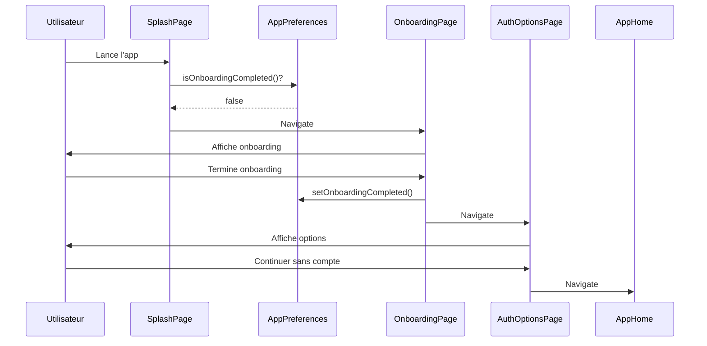
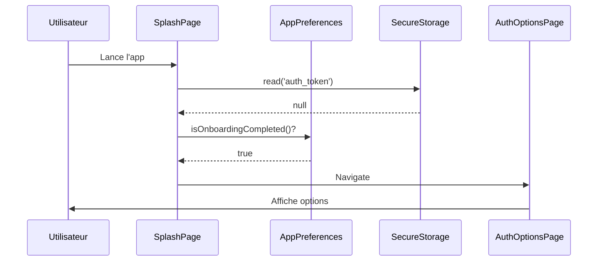
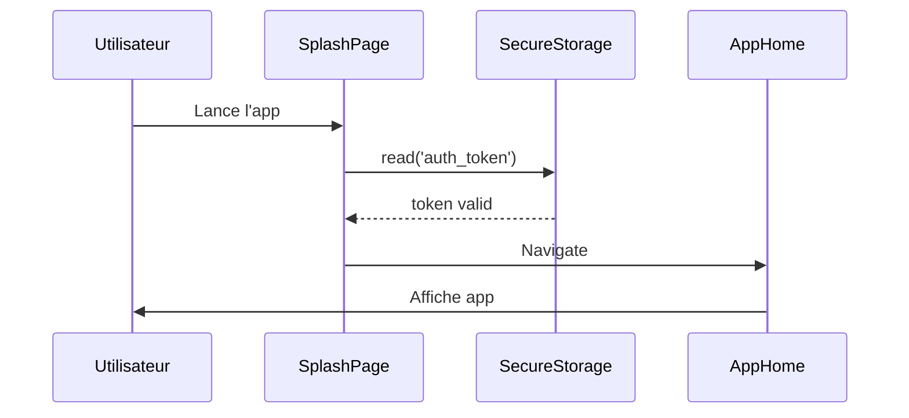
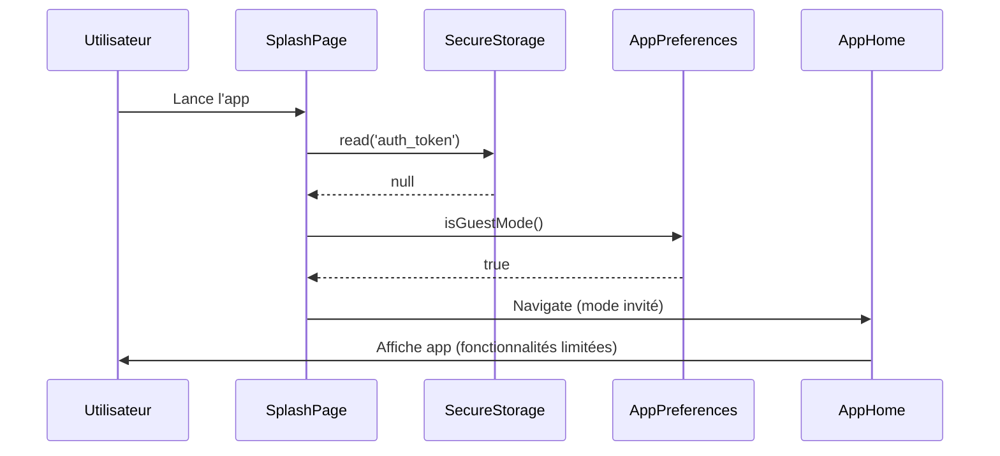

# Logique de Navigation - Flutter Boilerplate

Ce document décrit le flux de navigation de l'application Flutter Boilerplate.

---

## Vue d'ensemble

L'application utilise une architecture de navigation basée sur **GetX** avec gestion d'état et de préférences utilisateur.

---

## Flux de navigation principal

```
Démarrage de l'app
       ↓
   SplashPage (vérifie l'état)
       ↓
   ┌──────────────┬─────────────┬──────────────┐
   ↓              ↓             ↓              ↓
Authentifié ?  Mode invité ? Onboarding vu ? Première fois
   ↓              ↓             ↓              ↓
  App           App        AuthOptions    OnboardingPage
                               ↓              ↓
                          Login/Register  AuthOptions
                               ↓              ↓
                              App      Login/Register/Invité
                                           ↓
                                          App
```

**Légende** :
- **Authentifié** : Token valide trouvé → Accès complet
- **Mode invité** : Choix "Continuer sans compte" mémorisé → Accès limité
- **Onboarding vu** : Première utilisation terminée → Choix d'authentification
- **Première fois** : Jamais utilisé → Onboarding

---

## Pages principales

### 1. SplashPage

**Fichier** : `lib/features/onboarding/splash_page.dart`

**Rôle** : Page de démarrage qui gère la logique de navigation initiale.

**Logique** :
1. Affiche le logo et une animation pendant 2,5 secondes
2. Vérifie si un token d'authentification existe
3. Si authentifié → redirige vers `AppHome`
4. Si non authentifié, vérifie si le mode invité est activé
5. Si mode invité → redirige vers `AppHome` (sans authentification)
6. Si pas en mode invité :
   - Vérifie si l'onboarding a été complété
   - Si oui → redirige vers `AuthOptionsPage`
   - Si non → redirige vers `OnboardingPage`

**Technologies** :
- Animations Flutter natives (`AnimationController`)
- `flutter_animate` pour les animations avancées
- `FlutterSecureStorage` pour vérifier le token
- `AppPreferences` pour l'état de l'onboarding

---

### 2. OnboardingPage

**Fichier** : `lib/features/onboarding/onboarding.dart`

**Rôle** : Présentation des fonctionnalités de l'application aux nouveaux utilisateurs.

**Fonctionnalités** :
- 5 écrans avec images, titres et descriptions
- Auto-slide toutes les 6 secondes
- Bouton "Passer" pour ignorer l'onboarding
- Bouton "Suivant" pour naviguer entre les écrans
- À la fin → redirige vers `AuthOptionsPage`

**Animations** :
- Fond animé avec circuit électronique
- Transitions fluides entre les pages
- Effets de fade et slide sur les éléments

**Marque l'onboarding comme complété** :
```dart
await AppPreferences.setOnboardingCompleted();
```

---

### 3. AuthOptionsPage

**Fichier** : `lib/features/auth/pages/auth_options.dart`

**Rôle** : Page d'options d'authentification présentée après l'onboarding.

**Options proposées** :
1. **S'inscrire** : Création d'un nouveau compte
2. **Se connecter** : Connexion à un compte existant
3. **Continuer sans compte** : Accès limité à l'application

**Comportement "Continuer sans compte"** :
- Active le mode invité via `AppPreferences.setGuestMode(true)`
- Redirige vers `AppHome` sans authentification
- **Mémorise le choix** : Au prochain lancement, l'utilisateur accède directement à l'app
- L'utilisateur peut parcourir l'application mais certaines fonctionnalités sont limitées :
  - Pas d'achat possible
  - Pas de favoris persistants
  - Pas d'historique de commandes
  - Pas de messagerie avec les vendeurs

**Sortir du mode invité** :
- L'utilisateur peut se connecter/s'inscrire depuis le profil
- Lors de la connexion, désactiver le mode invité : `AppPreferences.setGuestMode(false)`

**Design** :
- Interface moderne avec animations d'entrée
- Bouton primaire pour "S'inscrire" (plus visible)
- Bouton secondaire pour "Se connecter"
- Lien texte pour "Continuer sans compte"

---

### 4. AppHome

**Fichier** : `lib/features/app/app_page.dart`

**Rôle** : Page principale de l'application avec navigation par onglets.

**Structure** :
- Navigation bottom bar avec 4 onglets :
  1. Accueil (catalogue produits)
  2. Favoris
  3. Panier
  4. Profil
- Floating Action Button pour la messagerie

---

## Gestion des préférences

### AppPreferences

**Fichier** : `lib/core/preferences/app_preferences.dart`

**Méthodes** :

```dart
// Vérifier si l'onboarding a été vu
static Future<bool> isOnboardingSeen();

// Vérifier si l'onboarding a été complété
static Future<bool> isOnboardingCompleted();

// Marquer l'onboarding comme complété
static Future<void> setOnboardingCompleted();

// Vérifier si le mode invité est activé
static Future<bool> isGuestMode();

// Activer/désactiver le mode invité
static Future<void> setGuestMode(bool value);

// Réinitialiser l'onboarding (pour développement)
static Future<void> resetOnboarding();

// Réinitialiser toutes les préférences
static Future<void> resetAll();
```

**Stockage** : Utilise `SharedPreferences` pour persister les données localement.

---

## Gestion de l'authentification

### FlutterSecureStorage

Le token d'authentification est stocké de manière sécurisée :

```dart
// Lecture du token
final token = await secureStorage.read(key: 'auth_token');

// Écriture du token (après connexion/inscription)
await secureStorage.write(key: 'auth_token', value: token);

// Suppression du token (déconnexion)
await secureStorage.delete(key: 'auth_token');
```

---

## Routes de l'application

### AppRoutes

**Fichier** : `lib/core/constants/routes.dart`

**Routes définies** :
- `/splash` : Page splash
- `/onboarding` : Page d'onboarding
- `/auth-options` : Options d'authentification
- `/login` : Connexion (à créer)
- `/register` : Inscription (à créer)
- `/app` : Page principale
- `/home` : Page d'accueil
- Autres routes pour les fonctionnalités spécifiques

---

## Configuration des transitions

**Fichier** : `lib/core/routes/app_routes.dart`

Les transitions entre pages sont configurées avec GetX :

```dart
GetPage(
  name: AppRoutes.splash,
  page: () => const SplashPage(),
  transition: Transition.fadeIn,
  transitionDuration: const Duration(milliseconds: 500),
)
```

**Types de transitions utilisées** :
- `fadeIn` : Pour les pages principales (splash, onboarding, app)
- `rightToLeft` : Pour les pages secondaires (login, register, détails)

---

## TODO - Fonctionnalités à implémenter

### Pages à créer

1. **LoginPage** : Page de connexion
   - Champs : email, mot de passe
   - Bouton "Se connecter"
   - Lien "Mot de passe oublié ?"
   - Validation des champs

2. **RegisterPage** : Page d'inscription
   - Champs : nom, prénom, email, téléphone, mot de passe, confirmation
   - Bouton "S'inscrire"
   - Acceptation des CGU
   - Validation des champs

3. **ForgotPasswordPage** : Page mot de passe oublié
   - Champ : email
   - Envoi d'un email de réinitialisation

### Services à compléter

1. **AuthController** : Contrôleur d'authentification
   - Gestion de la connexion
   - Gestion de l'inscription
   - Gestion de la déconnexion
   - Validation des tokens

2. **AuthRepository** : Repository d'authentification
   - Appels API pour login/register
   - Gestion des tokens
   - Refresh token

3. **ProfileController** : Contrôleur de profil
   - Récupération des informations utilisateur
   - Mise à jour du profil

4. **NotificationService** : Service de notifications
   - Gestion des notifications push
   - Affichage des notifications locales

---

## Diagramme de séquence

### Premier lancement (utilisateur non authentifié)



### Utilisateur revenant (onboarding complété, non authentifié)



### Utilisateur authentifié



### Utilisateur en mode invité (après avoir choisi "Continuer sans compte")



---

## Bonnes pratiques appliquées

### Clean Architecture

- **Séparation des couches** : UI, Business Logic, Data
- **Dépendances inversées** : Les couches hautes ne dépendent pas des couches basses
- **Single Responsibility** : Chaque classe a une responsabilité unique

### Clean Code

- **Nommage explicite** : Les noms de variables et fonctions sont clairs
- **Commentaires professionnels** : Chaque classe et méthode publique est documentée
- **Code lisible** : Formatage cohérent, pas de code dupliqué
- **Gestion d'erreurs** : try-catch avec logs appropriés

### Flutter Best Practices

- **StatelessWidget** vs **StatefulWidget** : Choix approprié selon le besoin
- **Const constructors** : Utilisation maximale pour optimiser les performances
- **Keys** : Utilisation de `super.key` pour identification des widgets
- **Animations** : Dispose des controllers dans `dispose()`

---

## Performance et optimisations

### Images

- **CachedNetworkImage** : Cache des images réseau pour réduire la bande passante
- **MemCache** : Limitation de la taille en mémoire
- **DiskCache** : Limitation de la taille sur disque

### Animations

- **AnimationController dispose** : Libération des ressources
- **RepaintBoundary** : Pour isoler les zones à repeindre
- **Opacity vs FadeTransition** : Utilisation de FadeTransition pour de meilleures performances

### État

- **GetX** : Gestion d'état réactive et performante
- **Lazy loading** : Chargement des contrôleurs uniquement quand nécessaire

---

## Sécurité

### Stockage des données sensibles

- **FlutterSecureStorage** : Pour les tokens d'authentification
- **SharedPreferences** : Pour les préférences non sensibles
- **Aucune donnée sensible en clair** : Toutes les données sensibles sont chiffrées

### Validation

- **Validation côté client** : Avant l'envoi au serveur
- **Validation côté serveur** : Pour la sécurité
- **Messages d'erreur clairs** : Sans révéler d'informations sensibles

---

## Débogage

### Logs

Tous les points critiques incluent des logs :

```dart
debugPrint('=== SPLASH ===');
debugPrint('Token: ${token != null ? "présent" : "absent"}');
debugPrint('Onboarding complété: $isOnboardingCompleted');
```

### Navigation tracking

Pour déboguer la navigation :

```dart
// Dans main.dart, ajouter un observer GetX
GetMaterialApp(
  navigatorObservers: [
    GetObserver((routing) {
      debugPrint('Route: ${routing.route}');
    }),
  ],
)
```

---

## Contact et support

Pour toute question sur la navigation ou la structure de l'application, consultez :
- [Guide de contribution](./CONTRIBUTING.md)

- [README](../README.md)

---

**Dernière mise à jour** : 2025-01-08

